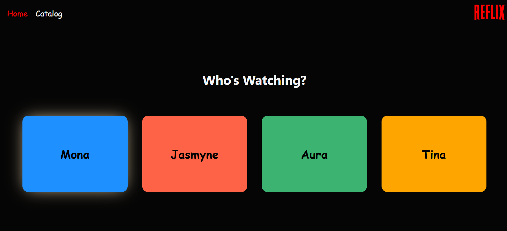
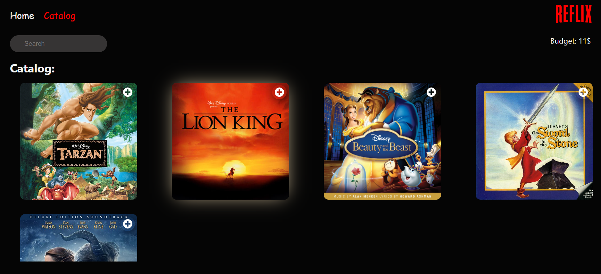
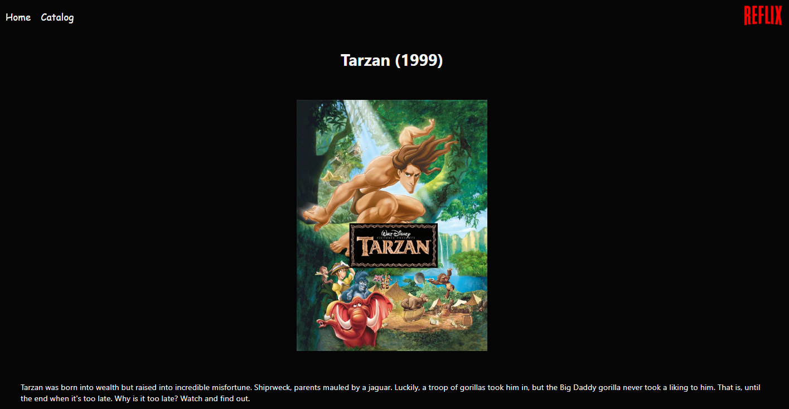

# Reflix

## Introduction

A front-end project written in React. This is a movie rental app, which allows a user to browse a catalog of movies, and select some to rent, so long as the user has the budget for it.

    

## Running instructions

1. clone the project

2. run `npm install`

3. run `npm start`

## Features

- Routing: used `react-router-dom` library to create 3 routes:

  - `/` - home screen, where you can select which user is currently watching.
  - `/catalog` - display all the available movies.

    

        
    

  - `/movies/:id` - display details of a movie with `id`

    

        
    

- Renting a movie: when clicking the + sign of a movie, it eill be rented and will be added to the rented movies list.

- Budget: renting a movie will decrease a budget. unrenting will increase the budget (as if the user returns the movie to the store).

- Search bar: you can search for a movie using the search bar. This is an online search, meaning that each letter the user types will triger the search engine.
